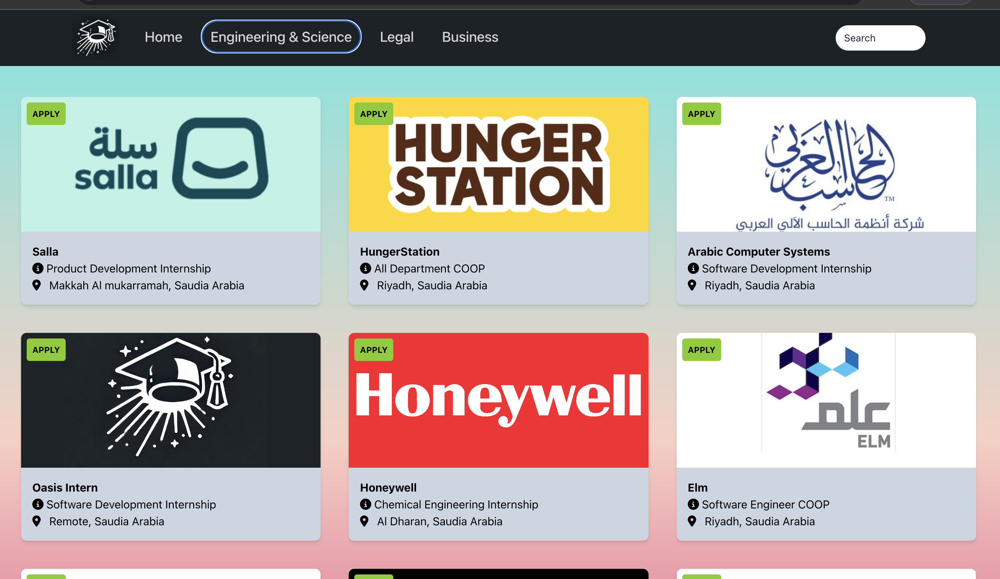

# Oasis Intern 

Oasis is a platform that connects students with companies looking for talented interns. Students can easily search for internships, while companies can post listings to attract skilled students looking for hands-on experience. 

## Table of Contents
- [Features](#features)
- [Demo](#demo)
- [Usage](#usage)
- [License](#license)
- [Acknowledgments](#acknowledgments)

## Features
- User Authentication: Secure login and signup system with session management to protect user data.
- Job Opportunities: Provides internships and job openings in Engineering, Business, and Legal fields.
- Search Functionality: Allows users to filter and search opportunities based on companies, roles, and locations.
- Status Tracking: Displays the application status for each opportunity (e.g., "Apply" or "Closed").
- Responsive Design: Optimized for mobile and desktop use.
- Analytics: Page views and interaction events are tracked using Google Analytics 4.

## Demo
Screenshot of Oasis Intern in action:

##Usage 
- Signup/Login: Create an account or log in using your credentials.
- Explore Opportunities: Browse internships and jobs by clicking on categories like Engineering, Business, or Legal.
- Search: Use the search bar to filter opportunities by company, role, or location.
- Track Applications: View the status of job opportunities and apply through the provided links.

##Pages Overview
-Main Page (/): The home page where users can browse and search for various opportunities.
-Signup (/signup): Page for new users to create an account.
-Login (/login): Page for existing users to log in.
-Profile (/profile): User profile page (authentication required).
-Business (/business): Displays business-related internships fetched from an API and includes the status of each listing.
-Engineering (/engineering): Engineering opportunities.
-Legal (/legal): Legal field opportunities.
-Oasis Internships (/oasis): Special page with additional opportunities and application instructions in Arabic.

##Acknowledgments
Special thanks to the libraries and tools that helped in the development:

-React
-React Router DOM
-Axios
-FontAwesome
-Google Analytics
